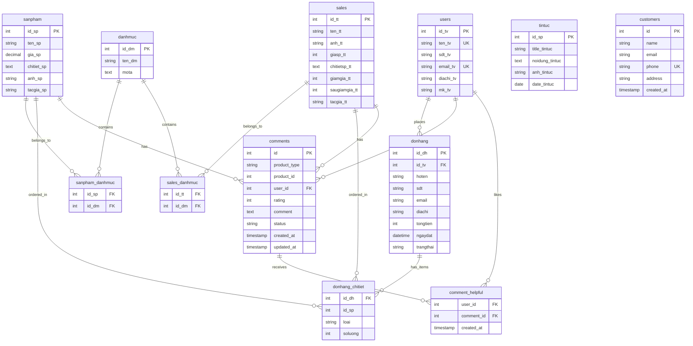

# Database Schema - DuongDinhManh_TH28.31

## Database Name: `manh`

## 1. Bảng Database Chi Tiết

### 1.1. Bảng `users` (Người dùng)
| Column | Type | Key | Description |
|--------|------|-----|-------------|
| id_tv | INT | PRIMARY KEY, AUTO_INCREMENT | ID người dùng |
| ten_tv | VARCHAR(150) | UNIQUE | Tên tài khoản |
| sdt_tv | VARCHAR(50) | | Số điện thoại |
| email_tv | VARCHAR(150) | UNIQUE | Email |
| diachi_tv | VARCHAR(255) | | Địa chỉ |
| mk_tv | VARCHAR(255) | | Mật khẩu (đã hash) |

### 1.2. Bảng `sanpham` (Sản phẩm)
| Column | Type | Key | Description |
|--------|------|-----|-------------|
| id_sp | INT | PRIMARY KEY | ID sản phẩm |
| ten_sp | VARCHAR(255) | | Tên sản phẩm |
| gia_sp | DECIMAL(10,2) | | Giá sản phẩm |
| chitiet_sp | TEXT | | Chi tiết sản phẩm |
| anh_sp | VARCHAR(255) | | Đường dẫn ảnh |
| tacgia_sp | VARCHAR(255) | | Tác giả |

### 1.3. Bảng `sales` (Sản phẩm khuyến mãi)
| Column | Type | Key | Description |
|--------|------|-----|-------------|
| id_tt | INT | PRIMARY KEY | ID khuyến mãi |
| ten_tt | VARCHAR(255) | | Tên sản phẩm KM |
| anh_tt | VARCHAR(255) | | Ảnh sản phẩm KM |
| giasp_tt | INT | | Giá gốc |
| chitietsp_tt | TEXT | | Chi tiết SP |
| giamgia_tt | INT | | % giảm giá |
| saugiamgia_tt | INT | | Giá sau giảm |
| tacgia_tt | VARCHAR(255) | | Tác giả |

### 1.4. Bảng `danhmuc` (Danh mục)
| Column | Type | Key | Description |
|--------|------|-----|-------------|
| id_dm | INT | PRIMARY KEY, AUTO_INCREMENT | ID danh mục |
| ten_dm | VARCHAR(100) | | Tên danh mục |
| mota | TEXT | | Mô tả |

### 1.5. Bảng `sanpham_danhmuc` (Liên kết SP-DM)
| Column | Type | Key | Description |
|--------|------|-----|-------------|
| id_sp | INT | FOREIGN KEY | ID sản phẩm |
| id_dm | INT | FOREIGN KEY | ID danh mục |

### 1.6. Bảng `sales_danhmuc` (Liên kết Sales-DM)
| Column | Type | Key | Description |
|--------|------|-----|-------------|
| id_tt | INT | FOREIGN KEY | ID khuyến mãi |
| id_dm | INT | FOREIGN KEY | ID danh mục |

### 1.7. Bảng `donhang` (Đơn hàng)
| Column | Type | Key | Description |
|--------|------|-----|-------------|
| id_dh | INT | PRIMARY KEY, AUTO_INCREMENT | ID đơn hàng |
| id_tv | INT | FOREIGN KEY | ID người dùng |
| hoten | VARCHAR(150) | | Họ tên người nhận |
| sdt | VARCHAR(50) | | SĐT người nhận |
| email | VARCHAR(255) | | Email người nhận |
| diachi | VARCHAR(255) | | Địa chỉ giao |
| tongtien | INT | | Tổng tiền |
| ngaydat | DATETIME | | Ngày đặt hàng |
| trangthai | VARCHAR(50) | | Trạng thái đơn |

### 1.8. Bảng `donhang_chitiet` (Chi tiết đơn hàng)
| Column | Type | Key | Description |
|--------|------|-----|-------------|
| id_dh | INT | FOREIGN KEY | ID đơn hàng |
| id_sp | INT | | ID sản phẩm |
| loai | VARCHAR(50) | | Loại (sanpham/sales) |
| soluong | INT | | Số lượng |

### 1.9. Bảng `tintuc` (Tin tức)
| Column | Type | Key | Description |
|--------|------|-----|-------------|
| id_sp | INT | PRIMARY KEY | ID tin tức |
| title_tintuc | VARCHAR(255) | | Tiêu đề |
| noidung_tintuc | TEXT | | Nội dung |
| anh_tintuc | VARCHAR(255) | | Ảnh tin tức |
| date_tintuc | DATE | | Ngày đăng |

### 1.10. Bảng `comments` (Bình luận)
| Column | Type | Key | Description |
|--------|------|-----|-------------|
| id | INT | PRIMARY KEY, AUTO_INCREMENT | ID bình luận |
| product_type | ENUM('sanpham','sale') | | Loại sản phẩm |
| product_id | INT | | ID sản phẩm |
| user_id | INT | FOREIGN KEY | ID người dùng |
| rating | INT | | Đánh giá (1-5) |
| comment | TEXT | | Nội dung BL |
| status | ENUM('pending','approved','rejected') | | Trạng thái |
| created_at | TIMESTAMP | | Ngày tạo |
| updated_at | TIMESTAMP | | Ngày cập nhật |

### 1.11. Bảng `comment_helpful` (Lượt thích bình luận)
| Column | Type | Key | Description |
|--------|------|-----|-------------|
| user_id | INT | | ID người dùng |
| comment_id | INT | | ID bình luận |
| created_at | TIMESTAMP | | Ngày tạo |

### 1.12. Bảng `customers` (Khách hàng)
| Column | Type | Key | Description |
|--------|------|-----|-------------|
| id | INT | PRIMARY KEY, AUTO_INCREMENT | ID khách hàng |
| name | VARCHAR(150) | | Tên KH |
| email | VARCHAR(150) | | Email |
| phone | VARCHAR(50) | UNIQUE | SĐT |
| address | VARCHAR(255) | | Địa chỉ |
| created_at | TIMESTAMP | | Ngày tạo |

### 1.13. Bảng `blockchain_audit_events` (Sự kiện audit blockchain)
| Column | Type | Key | Description |
|--------|------|-----|-------------|
| id | INT | PRIMARY KEY, AUTO_INCREMENT | ID sự kiện audit |
| entity_type | VARCHAR(80) | INDEX | Loại đối tượng: order/product/sale/category/comment/news/user |
| entity_id | INT | INDEX | ID đối tượng nghiệp vụ |
| action | VARCHAR(120) | INDEX | Hành động đã xảy ra |
| actor_type | VARCHAR(50) | | Loại tác nhân: user/admin/system |
| actor_id | INT | | ID tác nhân nếu có |
| payload_hash | CHAR(66) | INDEX | Hash SHA-256 dạng `0x...` của payload đã chuẩn hóa |
| previous_hash | CHAR(66) | | Hash sự kiện audit liền trước trong chuỗi local |
| event_hash | CHAR(66) | INDEX | Hash của event hiện tại, dùng để phát hiện chỉnh sửa chuỗi audit |
| payload_json | LONGTEXT | | Payload nội bộ đã loại bỏ dữ liệu cá nhân |
| pii_policy | VARCHAR(255) | | Chính sách xử lý dữ liệu riêng tư |
| status | ENUM | INDEX | disabled/pending/confirmed/failed |
| error_message | VARCHAR(500) | | Lỗi cấu hình/RPC đã lọc nếu có |
| created_at | TIMESTAMP | | Thời điểm ghi audit |
| updated_at | TIMESTAMP | | Thời điểm cập nhật audit |

### 1.14. Bảng `blockchain_receipts` (Biên nhận giao dịch blockchain)
| Column | Type | Key | Description |
|--------|------|-----|-------------|
| id | INT | PRIMARY KEY, AUTO_INCREMENT | ID biên nhận |
| audit_event_id | INT | FOREIGN KEY | Sự kiện audit tương ứng |
| network | VARCHAR(80) | | Tên mạng blockchain |
| chain_id | INT | | Chain ID |
| contract_address | VARCHAR(120) | | Địa chỉ smart contract |
| tx_hash | VARCHAR(120) | INDEX | Transaction hash |
| block_number | BIGINT | | Số block xác nhận |
| block_hash | VARCHAR(120) | | Hash block |
| confirmed_at | DATETIME | | Thời điểm xác nhận |
| created_at | TIMESTAMP | | Thời điểm lưu biên nhận |

> Blockchain audit chỉ đưa hash và metadata nghiệp vụ lên chain. Họ tên, số điện thoại, email, địa chỉ, mật khẩu và nội dung bình luận thô không được ghi vào payload blockchain.

## 2. Database Relationships Diagram

## 3. Tổng Quan Hệ Thống

### Mô tả chức năng chính:
1. **Quản lý người dùng**: Đăng ký, đăng nhập, quản lý hồ sơ
2. **Quản lý sản phẩm**: Sản phẩm thường và sản phẩm khuyến mãi (sales)
3. **Danh mục**: Phân loại sản phẩm theo nhiều danh mục
4. **Đơn hàng**: Xử lý đặt hàng, theo dõi trạng thái
5. **Bình luận & Đánh giá**: Người dùng có thể bình luận và đánh giá sản phẩm
6. **Tin tức**: Quản lý và hiển thị tin tức
7. **Khách hàng**: Tự động đồng bộ từ đơn hàng

### Đặc điểm kỹ thuật:
- Database: MySQL/MariaDB
- Charset: utf8mb4
- Engine: InnoDB
- Sử dụng Prepared Statements để bảo mật
- Password hashing với password_hash()
- Quan hệ nhiều-nhiều giữa sản phẩm và danh mục

## 4. Indexes & Keys

### Primary Keys:
- users(id_tv)
- sanpham(id_sp) 
- sales(id_tt)
- danhmuc(id_dm)
- donhang(id_dh)
- tintuc(id_sp)
- comments(id)
- customers(id)

### Unique Keys:
- users(ten_tv)
- users(email_tv)
- customers(phone)

### Foreign Keys:
- donhang(id_tv) → users(id_tv)
- sanpham_danhmuc(id_sp) → sanpham(id_sp)
- sanpham_danhmuc(id_dm) → danhmuc(id_dm)
- sales_danhmuc(id_tt) → sales(id_tt)
- sales_danhmuc(id_dm) → danhmuc(id_dm)
- donhang_chitiet(id_dh) → donhang(id_dh)
- comments(user_id) → users(id_tv)
- comment_helpful(user_id) → users(id_tv)
- comment_helpful(comment_id) → comments(id)
